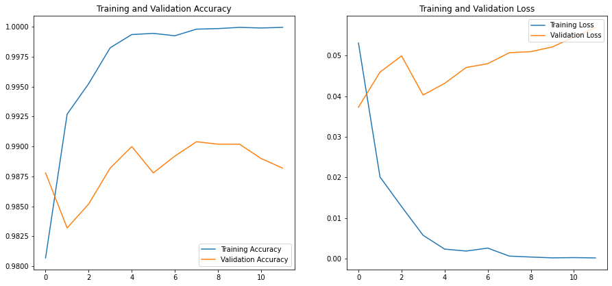

# Introduction

In this project, I will be answering the most pressing question of our generation: _How do we distinguish between images of cats and dogs?_

In all seriousness, this is a great problem to explore the potential of deep learning and specifically, transfer learning on a simple task of classifying between images of cats and dogs.

The tools I will be using in this project are:

- [Python](https://www.python.org/)
  - Typical Data Science tools such as [Pandas](https://pandas.pydata.org/), [Numpy](https://www.numpy.org/), and [Matplotlib](https://matplotlib.org/)
- [Keras](https://keras.io/)
  - High level library built on top of Tensorflow for creating neural networks
- [TensorFlow](https://www.tensorflow.org/)
  - The underlying library for Keras used for deep learning computation
- [Kaggle](https://www.kaggle.com/competitions/dogs-vs-cats-redux-kernels-edition)
  - The competition site for this project. Create a Classifier model with the lowest prediction error possible
- [Google Colab](https://colab.research.google.com/)
  - A Google-hosted cloud platform for running Jupyter notebooks. Useful when coding away from home, or in need of a high end GPU for deep learning

The steps I will be taking in this project are:

1. Import the data from Kaggle into Google Colab Environment
2. Preprocess the data for Keras
3. Setup and Train the Keras ResNet152V2 model
4. Evaluate the model on the test set
5. Create a submission file for the Kaggle competition

# Data Preparation

Here is an overview of the libraries needed for the project:

```python
# Tools
import pandas as pd
from sklearn.model_selection import train_test_split
import matplotlib.pyplot as plt
import numpy as np
import math
import os

# ML
import tensorflow as tf
from keras.models import Sequential
from keras.layers import Dense
from keras import losses
from keras.callbacks import EarlyStopping
from keras.layers import BatchNormalization

import random
import cv2
from tensorflow import keras

from keras.models import Sequential
from keras.layers import Input, Dropout, Flatten, Conv2D, MaxPool2D, Dense, Activation
from keras.callbacks import ModelCheckpoint, Callback, EarlyStopping
from keras.utils import np_utils
from keras.preprocessing.image import ImageDataGenerator
from keras import layers
from tensorflow.keras.applications.resnet_v2 import preprocess_input
from tensorflow.keras.applications import ResNet152V2

np.random.seed(42)
tf.random.set_seed(42)
```

Before we can begin, we will need to create a repeatable workflow for importing the data from Kaggle into our Colab environment.

[This Article](https://www.analyticsvidhya.com/blog/2021/06/how-to-load-kaggle-datasets-directly-into-google-colab/) gives a good explanation on how to set up a download directly from the Kaggle competition we are interested in.

```python
# upload kaggle.json to Colab base directory
! mkdir ~/.kaggle
! cp kaggle.json ~/.kaggle/
! chmod 600 ~/.kaggle/kaggle.json
```

```python
# Download and unzip the data
! kaggle competitions download dogs-vs-cats-redux-kernels-edition
! unzip dogs-vs-cats-redux-kernels-edition.zip
```

```python
# Unzip the internal test and train data
%%capture
! unzip test.zip
! unzip train.zip
```

## Folder Setup

Keras [image data generator](https://keras.io/preprocessing/image/) is the tool we will use for reading the training and testing data. It requires that the images are stored within a labelled folder structure so we will move the images to new directories.

```python
# Create labelled directories
train_folder = 'train/'
train_images = [i for i in os.listdir(train_folder)]
dog = 'train/dog'
cat = 'train/cat'
os.mkdir(dog)
os.mkdir(cat)

# Move train images to labelled folders
for image in train_images:
  if 'dog' in image:
    os.replace(os.path.join(train_folder, image), os.path.join(dog, image))
  elif 'cat' in image:
    os.replace(os.path.join(train_folder, image), os.path.join(cat, image))
```

```python
# Move test images to test folder
test_images = [i for i in os.listdir('test/')]
os.mkdir('test/test_images')
for image in test_images:
  os.replace(os.path.join('test/', image), os.path.join('test/test_images', image))
```

## Pipeline setup

With the directories setup, we can now setup the data pipeline for Keras using `ImageDataGenerator`.

```python
train_image_gen = ImageDataGenerator(rescale=1/255, horizontal_flip=True, validation_split=0.2)
test_image_gen = ImageDataGenerator(rescale=1/255)
```

We will use the `validation_split` parameter to split the training data into a training set and validation set. 20% of the training data will be used for validation. The remaining test data will be used for validation after we have finalized our model hyperparameters.

```python
image_size = (224, 224)
batch_size = 64

train_generator = train_image_gen.flow_from_directory(
    'train',
    target_size=image_size,
    batch_size=batch_size,
    seed=12,
    subset='training',
    shuffle=True,
    class_mode='binary'
)
val_generator = train_image_gen.flow_from_directory(
    'train',
    target_size=image_size,
    batch_size=batch_size,
    seed=12,
    subset='validation',
    shuffle=True,
    class_mode='binary'
)

test_generator = test_image_gen.flow_from_directory(
    'test',
    target_size=image_size,
    batch_size=1,
    seed=12,
    class_mode=None,
    shuffle=False
)
```

# ResNet Model

We will be using the pretrained [ResNet152V2](https://keras.io/applications/#resnetv2) model from Keras for our classification task. This model is a great starting point for transfer learning because of its depth, flexibility, and performance on image classification.

The ResNet152V2 model is a [wide residual network](https://arxiv.org/abs/1605.07146) that is trained on the [ImageNet](https://www.image-net.org/) dataset. This dataset contains images that are 224x224 pixels, so we rescaled our dog and cat images to 224x224 pixels to make the model feel at home :)

We can initiate the ResNet model with a simple code chunk in Keras. We set the `weights` parameter to 'imagenet' to load the pretrained weights of the model.

```python
resnet = ResNet152V2(
    include_top=False,
    weights='imagenet'
)
```

```python
len(resnet.layers)
```

Checking the layer depth shows 564 trainable layers within the model. As a starting point, we will freeze the first 95% of the layers to retain the bulk of the pretrained model complexity. The remaining 5% will be set to trainable so that our model can fit to our cat and dog images.

```python
# 564 resnet layers total
for layer in resnet.layers[:535]:
    layer.trainable =False
for layer in resnet.layers[535:]:
    layer.trainable=True
```

Next, we will add a global average pooling layer and a dense fully connected layer to our model. The pooling layer will summarize our feature maps and the dense layer will make predictions using a sigmoid activation function to map predictions to probabilities between 0 and 1.

```python
x = resnet.output
x = layers.GlobalAveragePooling2D()(x)
predictions = Dense(1, activation= 'sigmoid')(x)
model = tf.keras.Model(inputs = resnet.input, outputs = predictions)
```

To improve our model tuning and performance, we will use the `Adam` optimizer and the `binary_crossentropy` loss function to measure validation error against the 20% of training images we set aside for validation. Because this is a transfer learning problem, we will set adam's learning rate to 0.0005, since fast learning is not needed for the 5% of layers we are training.

We will also implement early stopping and learning rate decay to prevent overfitting as the model begins to fit our data.

```python
LR = keras.callbacks.ReduceLROnPlateau(monitor='val_accuracy', patience=2, verbose=1, factor=.5, min_lr=.00001)
EarlyStop = keras.callbacks.EarlyStopping(monitor='val_accuracy', patience=4, restore_best_weights=True)

epochs = 15

model.compile(
    optimizer=tf.keras.optimizers.Adam(learning_rate=0.0005),
    loss="binary_crossentropy",
    metrics=["accuracy"]
)
```

## Model Training

Finally, we can fit our model to our training data. The validation results will be saved to the `history` object.

```python
history = model.fit(
    train_generator,
    epochs=epochs,
    callbacks=[EarlyStop, LR],
    validation_data=val_generator
)
```

The final model results printed to the console show the model achieved an accuracy of 0.988 on its 12th pass through the data.

```
Epoch 12: ReduceLROnPlateau reducing learning rate to 3.125000148429535e-05.
313/313 [==============================] - 107s 342ms/step - loss: 1.9357e-04 - accuracy: 0.9999 - val_loss: 0.0570 - val_accuracy: 0.9882 - lr: 6.2500e-05
```

This will suit us fine for this competition. However, if we wanted to refine the model further we could use KerasTuner to optimize parameters further. Here are some parameters that we could refine in the future:

- `Image_Size` = (224, 224)
- `Batch_Size` = 64
- `Learning_Rate_init` = 0.0005
- Frozen Resnet Layers = [:535]

Before we move on, lets make sure to save our model to disk so we can use it later without retraining.

```python
# Save Model
model.save('resnet152v2')
# Zip model in Colab
!zip -r /content/resnet152v2.zip /content/resnet152v2
```

Now, if we wished to import our trained model into our notebook, we can use the following code:

```python
# Load Model
model = tf.keras.models.load_model('resnet152v2')
```

# Model Evaluation

By examining the validation results saved to the `history` object, we can see that our model is performing well.

```python
acc = history.history['accuracy']
val_acc = history.history['val_accuracy']
loss = history.history['loss']
val_loss = history.history['val_loss']

n_ep = len(history.history['loss'])
epochs_range = range(n_ep)

plt.figure(figsize=(15, 15))
plt.subplot(2, 2, 1)
plt.plot(epochs_range, acc, label='Training Accuracy')
plt.plot(epochs_range, val_acc, label='Validation Accuracy')
plt.legend(loc='lower right')
plt.title('Training and Validation Accuracy')

plt.subplot(2, 2, 2)
plt.plot(epochs_range, loss, label='Training Loss')
plt.plot(epochs_range, val_loss, label='Validation Loss')
plt.legend(loc='upper right')
plt.title('Training and Validation Loss')
plt.show()
```



## Validation on Test Data

Using the `test_generator` we setup previously, we can create predictions on the test data.

```python
predictions = model.predict(test_generator,verbose=1)
```

It is important for our Kaggle submission that the predictions are in numeric order, so we will reindex the predictions.

```python
import re

image_index = []
for i in test_generator.filenames:
  image_index += [int(s) for s in re.findall(r'\b\d+\b', i)]

print(image_index[0:10])
```

We can now use the `pandas` library to create a dataframe of our predictions along with the associated image id.

```python
pred_tuples = list(zip(image_index, predictions.flatten().tolist()))
pred = pd.DataFrame(pred_tuples, columns=['id','label'])
pred = pred.sort_values(by='id')
print(pred[:5])
```

Results:

```
      id         label
0      1  9.999999e-01
3612   2  1.000000e+00
4723   3  9.999992e-01
5834   4  1.000000e+00
6945   5  4.059837e-07
```

Before we submit to Kaggle, we can use a trick I found from [Egor Vorobiev](https://medium.com/@egor_vorobiev/how-to-improve-log-loss-score-kaggle-trick-3f95577839f1) that can help improve our Kaggle score.

Because the automated evaluation uses log-loss scoring, we can clip our predictions to a limited range so that we are not penalized for overconfident predictions near the edge of the probability distribution.

```python
# clip predictions
pred['label'] = pred['label'].clip(0.005, 0.995)
```

Finally, we can save our dataframe to a csv file and submit it directly to the Kaggle competition.

```python
pred.to_csv('result.csv', index=False)

!kaggle competitions submit -c dogs-vs-cats-redux-kernels-edition -f result.csv -m "Message"
```

# Conclusion

Our final Kaggle score is a log-loss of 0.05538. This places us in the top 8% of [submissions](https://www.kaggle.com/competitions/dogs-vs-cats-redux-kernels-edition/leaderboard) in an expired competition. Not bad!

So what did we learn along the way?

- Don't reinvent the wheel
  - The ResNet architecture is already great at image classification, there's no harm in borrowing existing models as a starting point for a more focused task.
- Plan ahead
  - Keras offers many different routes to ingesting data. [This article](https://towardsdatascience.com/what-is-the-best-input-pipeline-to-train-image-classification-models-with-tf-keras-eb3fe26d3cc5) does a great job of explaining the pros and cons of each approach, but had I not researched these methods prior I would have lost a lot of time chasing the wrong approach.

```
 _______  __   __  _______  __    _  ___   _  _______
|       ||  | |  ||   _   ||  |  | ||   | | ||       |
|_     _||  |_|  ||  |_|  ||   |_| ||   |_| ||  _____|
  |   |  |       ||       ||       ||      _|| |_____
  |   |  |       ||       ||  _    ||     |_ |_____  |
  |   |  |   _   ||   _   || | |   ||    _  | _____| |
  |___|  |__| |__||__| |__||_|  |__||___| |_||_______|
 _______  _______  ______
|       ||       ||    _ |
|    ___||   _   ||   | ||
|   |___ |  | |  ||   |_||_
|    ___||  |_|  ||    __  |
|   |    |       ||   |  | |
|___|    |_______||___|  |_|
 ______    _______  _______  ______   ___   __    _  _______
|    _ |  |       ||   _   ||      | |   | |  |  | ||       |
|   | ||  |    ___||  |_|  ||  _    ||   | |   |_| ||    ___|
|   |_||_ |   |___ |       || | |   ||   | |       ||   | __
|    __  ||    ___||       || |_|   ||   | |  _    ||   ||  |
|   |  | ||   |___ |   _   ||       ||   | | | |   ||   |_| |
|___|  |_||_______||__| |__||______| |___| |_|  |__||_______|
```
